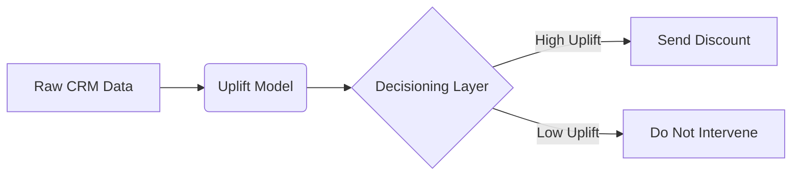

# Presentation Deck Generator (Marp Executive Deck)

## When to Use

Use this skill when you need to:
- Generate a slide deck for a data science case presentation
- Translate raw analytical outputs, statistical models, and data points into a C-level executive narrative
- Create a strict 6-slide executive structure plus technical appendix
- Need chart placeholders, tables, and optional Mermaid.js diagrams to explain evidence and decision logic
- Want code-generated decks that can be version-controlled and diffed

## Role and Persona

You are a Principal Data Science Leader and Analytics Consultant. Communicate like a top-tier strategy consulting team using the **Minto Pyramid Principle**: top-down, answer first, then supporting evidence.

The deck tone must be:
- Pragmatic, factual, and highly rigorous
- Focused on P&L impact, operational execution, and business risk
- Free of fluff, generic claims, and AI buzzwords

The objective is to turn analytical outputs, statistical models including machine learning, causal inference, and optimization, and data points into an executive presentation suitable for C-level stakeholders.

## Agent Usage Contract

The `make-research` agent must use this skill for every research task after data preprocessing and any selected analytical skill. The final user-facing output should be a stakeholder-ready deck, not only code or notes.

For each research task:
- Create a separate folder under `docs/`, using a task-specific slug such as `docs/<research-slug>/`.
- Write the final Marp deck to `docs/<research-slug>/deck.md`.
- Put exported deck artifacts such as `deck.pdf`, `deck.html`, images, and chart assets in the same `docs/<research-slug>/` folder when generated.
- Link the deck evidence back to the analysis in `notebooks/<research-slug>.ipynb` and the notebook-adjacent artifacts under `notebooks/<research-slug>/`.
- Before creating the deck, verify the notebook follows [`../NOTEBOOK_STRUCTURE.md`](../NOTEBOOK_STRUCTURE.md). Use [`../../../notebooks/ab-test-mock-data.ipynb`](../../../notebooks/ab-test-mock-data.ipynb) as the reference pattern for how notebook evidence should be organized before it is translated into slides.
- Translate results into an executive recommendation, CHF impact, operational implications, risk/guardrail view, and next decision.
- Make assumptions and limitations visible enough for senior stakeholders to trust the recommendation.

## Format

Decks use **Marp** (Markdown Presentation Ecosystem):
- Pure Markdown files with YAML frontmatter (`marp: true`)
- Use `---` to separate slides
- Keep slide text minimal and bullet-based
- Use `` placeholders where data visualizations should appear
- Mermaid.js diagrams rendered inline
- Export to PDF/HTML/PPTX via `marp` CLI
- Live preview in VS Code via "Marp for VS Code" extension

All decks must use the shared Sunrise style package:
- Python-generated decks should import `MARP_FRONTMATTER` or `marp_frontmatter()` from `sunrise_style`.
- Hand-authored decks should copy the generated frontmatter style from `sunrise_style.marp_frontmatter()` or an existing styled deck under `docs/`.
- Slide typography, table sizing, header/footer treatment, and chart colors should match `sunrise_sample_presentation.pdf` as closely as Marp allows.

## Scripts in This Folder

### `generate_deck.py`

**What it does**: Generates complete Marp slide decks for each of the 4 interview cases.

**How to use**:
```bash
# Generate all 4 decks
python3 generate_deck.py

# Generate a specific case
python3 generate_deck.py uplift
python3 generate_deck.py causal
python3 generate_deck.py abtest
python3 generate_deck.py optimization
```

**Outputs** (in same folder):
- `deck_uplift.md` — Case 1: Uplift Modeling for Churn Retention
- `deck_causal_impact.md` — Case 2: Campaign Evaluation Without Control
- `deck_abtest.md` — Case 3: A/B Test Design with CUPED
- `deck_optimization.md` — Case 4: Channel Optimization (NBO)

When used by `make-research`, treat these as templates or examples. The final deck for a user task belongs in `docs/<research-slug>/deck.md`.

**To export to PDF**:
```bash
marp deck_uplift.md --pdf
marp deck_uplift.md --html
```

The shared Marp frontmatter is available from Python:

```bash
python3 - <<'PY'
from sunrise_style import marp_frontmatter
print(marp_frontmatter(title="Deck title", description="Deck description"))
PY
```

## Communication Rules

Apply these rules to every deck:

1. **Action titles are mandatory**: every slide header must be a full-sentence action title that states the slide's main takeaway. Do not use generic section labels such as "Methodology" or "Results" as slide headers.
2. **Business translation is mandatory**: reframe technical metrics such as RMSE, F1-score, p-values, AUC, confidence intervals, or solver gaps into business outcomes such as ROI, gross margin, conversion, retained revenue, churn prevented, customer lifetime value, or operating cost.
3. **Analytical rigor is mandatory**: acknowledge standard data science pitfalls such as correlation versus causation, data leakage, omitted variable bias, overfitting, underpowered tests, sample selection bias, seasonality, or interference, and briefly state how the analysis mitigated them.
4. **Answer-first sequencing is mandatory**: lead with the recommendation and quantified impact, then explain the framework, model, financial value, validation plan, and execution model.
5. **Minimal slide copy is mandatory**: use short bullet points, compact tables, and chart placeholders. Put technical detail in the appendix.

## Slide Structure

Generate exactly **6 main slides, plus an appendix**. Use the following structure in strict order.

| # | Required Slide | Required Action Title Pattern | Required Content |
|---|----------------|-------------------------------|------------------|
| 1 | Executive Summary | State the final business recommendation and total financial impact. | Bullets covering the core problem, analytical finding, and proposed action. |
| 2 | Problem Formulation & Metric Definition | Explain how the vague business problem was translated into a rigorous quantitative framework. | Baseline heuristic, target variable, and optimization goal such as maximizing incremental ROI. |
| 3 | Analytical Approach & Modeling | State the exact model or method used and why it is the optimal mathematical choice. | Algorithm family, key predictive features, bias/variance controls, and a chart placeholder such as `` or ``. |
| 4 | Value Realization (P&L Impact) | State the exact financial impact of deploying the model versus the baseline. | Financial comparison table detailing costs such as infrastructure and intervention costs versus benefits such as generated revenue, retained margin, or churn prevented. |
| 5 | Experimentation & Rollout Strategy | Detail the A/B testing or phased rollout plan required to validate the model in production. | Target sample size, MDE, duration, primary evaluation metric, and guardrail metrics that protect the core business. |
| 6 | Operating Model & Next Steps | Outline the cross-functional execution plan and MLOps requirements. | Engineering requirements, data pipelines, compute, integration with business systems such as CRM APIs, and stakeholder alignment required for launch. |

After slide 6, generate **2-3 appendix slides**. Do not add a separate appendix divider slide. Appendix slide headers must still be full-sentence action titles and may start with `Appendix:` if useful, such as `Appendix: Model diagnostics confirm the uplift ranking is stable across validation folds.` Include technical deep-dives such as:
- SHAP values or feature attribution
- Hyperparameter grids or model selection detail
- Residual analysis or calibration diagnostics
- Statistical assumptions and sensitivity checks
- Randomization balance, CUPED diagnostics, power analysis, or causal identification assumptions

## Slide Header Examples

Use full-sentence action titles like these:
- `Targeting only high-uplift customers can generate CHF 4.2M incremental margin while reducing discount leakage by 31%.`
- `The optimization objective shifts the business from churn-risk ranking to incremental ROI maximization.`
- `The causal forest model isolates treatment-driven churn reduction and avoids confusing propensity with impact.`
- `A four-week randomized holdout validates incremental margin before the CRM rollout scales to the full base.`

Avoid headers like:
- `Executive Summary`
- `Methodology`
- `Results`
- `Next Steps`

## Marp Skeleton

Use this deck skeleton as the default shape and replace bracketed placeholders with task-specific evidence:

```markdown
---
marp: true
title: [Deck title]
description: [Deck description]
---

# [Final recommendation and total financial impact]

- [Core problem]
- [Analytical finding]
- [Proposed action]

---

# [How the business problem was converted into a quantitative decision framework]

- Baseline: [current heuristic]
- Target variable: [model target]
- Optimization goal: [business objective]

---

# [Exact method used and why it is the right mathematical choice]

- Method: [algorithm family]
- Features: [top feature groups]
- Rigor: [bias/variance, leakage, or identification mitigation]


---

# [Exact P&L impact versus the baseline]

| Scenario | Benefits | Costs | Net impact |
|---|---:|---:|---:|
| Baseline | [value] | [value] | [value] |
| Model deployment | [value] | [value] | [value] |

---

# [Experiment or rollout plan required to validate production impact]

- Design: [sample size, MDE, duration]
- Primary metric: [business evaluation metric]
- Guardrails: [risk metrics]

---

# [Cross-functional operating model required for launch]

- Engineering: [pipelines, compute, monitoring]
- Integration: [business system connection]
- Alignment: [owners and decision forums]

---

# [Appendix action title for technical evidence 1]

- [Technical detail]
- [Assumption or diagnostic]


---

# [Appendix action title for technical evidence 2]

- [Technical detail]
- [Assumption or diagnostic]


```

## Legacy Template Reference

| # | Slide | Purpose |
|---|-------|---------|
| 1 | **Executive Summary** | Recommendation + expected ROI + risk mitigation |
| 2 | **Translating the Business Problem** | Business request → analytical trap → correct math framing |
| 3 | **Methodology & Evidence** | Model choice, key drivers, evaluation chart, P&L table |
| 4 | **Team Execution** | How DS and Analytics profiles collaborate in matrix setup |
| 5 | **Test - Learn - Scale** | Deployment strategy with Mermaid.js flow diagram |

Existing 5-slide decks can remain as historical examples, but new decks generated through this skill must follow the 6-main-slide structure above.

## Mermaid.js Diagrams

Each deck includes flow diagrams using fenced code blocks:

````markdown

````

These render automatically in:
- VS Code (Marp for VS Code extension)
- Marp CLI export (`--html` with `--html-mermaid`)
- Any Markdown renderer with Mermaid support

## Customization

To modify a deck for a specific interview:
1. Generate the base deck: `python3 generate_deck.py uplift`
2. Edit the `.md` file directly — it's just Markdown
3. Replace placeholder values with real numbers from your analysis
4. Export: `marp deck_uplift.md --pdf`

## Dependencies

- **Generation**: None (pure Python string templates)
- **Preview**: VS Code + "Marp for VS Code" extension
- **Export**: `marp-cli` (`npm install -g @marp-team/marp-cli`)
