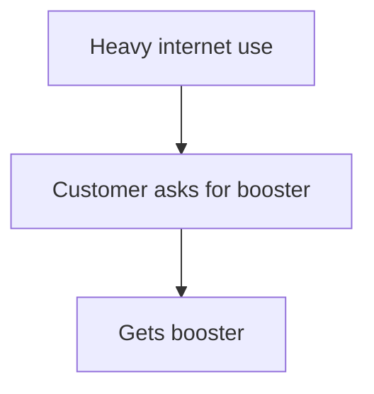
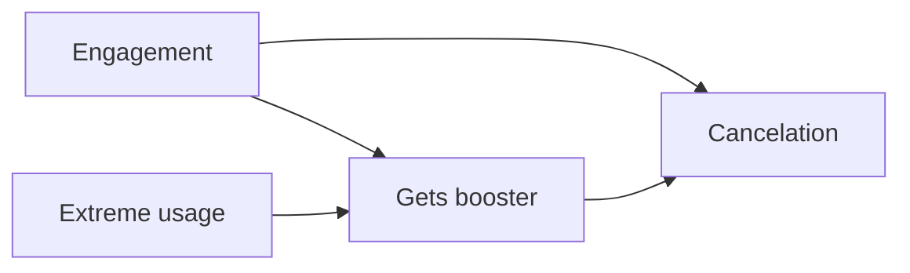
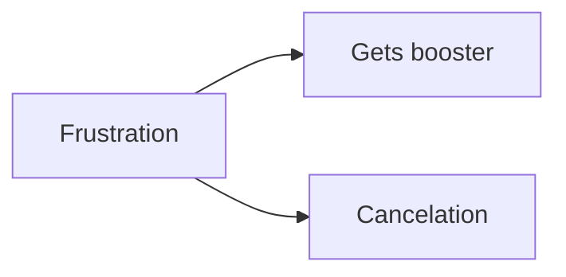

# Why consider A/B test? - Because of the latent confounding!

## 1. Example Process

Suppose the process is:

Now ask yourself:

**Who asks for the booster?**

Possibly customers who are:

- More engaged
- Frequent users of customer support
- Actively optimizing their tariff
- Technically savvy
- More satisfied
- More price-conscious

These characteristics are typically **not observed** or **not included in the model**, creating a potential source of confounding.

---

## 2. Latent Confounding

The underlying causal graph may instead look like:

Even after controlling for **internet usage**, the latent variable **engagement** still influences both:

- the probability of getting a booster, and
- the probability of cancelation.

As a result, the estimated booster effect may be biased because of **unobserved confounding**.

---

## 3. Alternative Scenario

Suppose customers ask for a booster because they are:

- Frustrated
- Close to leaving
- Exceeding their limits every month
- Frequent complainers

The causal graph becomes:

In this scenario, customers receiving a booster are **inherently at higher risk of cancelation**.

As a result, the estimated booster effect may be biased because of **unobserved confounding**.