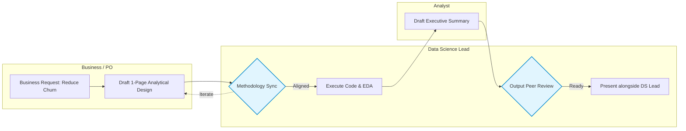
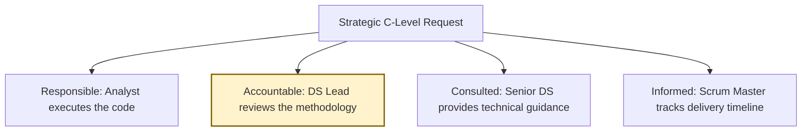
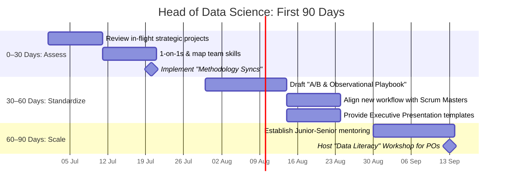

# Leadership & Process Proposal

---

# 1. Process Update: The "Methodology Sync"

**Observation:**  
The current workflow allows complex statistical tasks to be assigned and executed without early methodological review. This leads to wasted sprints and risky C-level presentations.

**Proposal:**  
Introduce an **Analytical Design Sync** at the start of a sprint. Before pulling data, analysts draft a brief outline (hypothesis, confounders, method) to review with a Lead.

---

# 2. Team Capability & Task Alignment

**Observation:**  
Task assignment currently relies on bandwidth rather than specific skill sets. The Junior Analyst has great technical skills but was left isolated on a task requiring advanced causal inference and executive storytelling.

**Proposal:**  
Map team capabilities to identify coaching opportunities and clarify roles so juniors are properly supported on high-visibility requests.

## Analyst Development Plan (Example)

| Core Skill | Current State | Focus Area | Actionable Next Step |
|------------|--------------|------------|----------------------|
| Data Eng / Coding | Strong (Pandas, SQL) | Maintain | Continue standard workflow |
| Decision Science | Developing | Causal Inference | Pair with Senior on observational data models |
| Storytelling | Developing | Executive-Level Communication | Practice "Bottom-Line-Up-Front" slide design |

## Clarified Task Alignment (RACI)

---

# 3. Proposed 30-60-90 Day Focus

A pragmatic rollout to align the team, standardize quality, and build community—without disrupting ongoing delivery.

