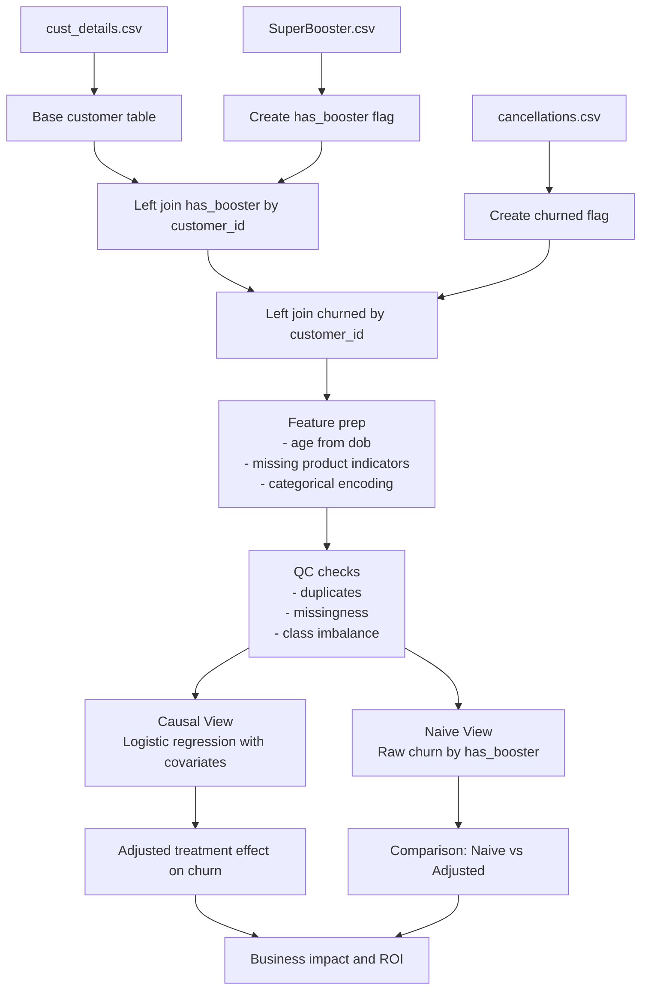

# SuperBooster Churn Impact Assessment

## Executive Summary
The junior analysis compares churn rates between customers who requested SuperBooster and those who did not. This is **not** a valid causal estimate because treatment assignment is self-selected, not randomized.

Customers who request a Wi-Fi booster are likely systematically different from others (for example, heavier internet users, different tenure profiles, or different product bundles). These same factors can independently affect churn. As a result, the naive churn gap mixes:

1. The true effect of SuperBooster.
2. Pre-existing risk differences between groups.

This is a classic **selection bias / confounding** problem. The project therefore reports two views:

1. **Naive view** for transparency.
2. **Causal-adjusted view** using logistic regression with observed covariates (and optional propensity score checks) to estimate the incremental churn reduction attributable to SuperBooster.

The business decision (roll out to 1.5M users or not) should be based on the causal-adjusted effect and corresponding ROI, not the naive comparison.

## Objective
Estimate whether giving SuperBooster to all 1.5 million internet customers is financially justified.

- Value of prevented churn: CHF 1,800 per customer.
- Booster unit cost: CHF 35 per customer.
- Full rollout cost: CHF 52,500,000.

## Data Assets
1. `cust_details.csv`: customer features and product mix.
2. `SuperBooster.csv`: treated customers (`has_booster = 1`).
3. `cancellations.csv`: churn label (`churned = 1`).

## Analytical Plan
1. Build analysis table at customer level.
2. Engineer treatment and outcome flags.
3. Run quality checks (join coverage, duplicates, missingness, category balance).
4. Produce naive churn comparison.
5. Fit causal-adjusted logistic regression.
6. Translate adjusted treatment effect to prevented churn and net ROI under full rollout.
7. Perform robustness checks (alternative model specifications, subgroup sanity checks).

## Data Wrangling and Modeling Pipeline

## Mathematical Framework
### 1) Naive Probability Comparison (Biased)
Let $T_i \in \{0,1\}$ indicate booster status and $Y_i \in \{0,1\}$ indicate churn.

Naive churn rates:

$$
\hat{p}_1 = P(Y=1 \mid T=1), \qquad \hat{p}_0 = P(Y=1 \mid T=0)
$$

Naive effect estimate:

$$
\Delta_{\text{naive}} = \hat{p}_1 - \hat{p}_0
$$

This is generally biased when $T$ is correlated with confounders $X$.

### 2) Causal-Adjusted Logistic Regression
Model churn probability controlling for observed confounders $X_i$ (tenure, internet usage, commune, age, gender, TV/mobile product indicators, ZIP bucket):

$$
\text{logit}\big(P(Y_i=1 \mid T_i, X_i)\big)
= \beta_0 + \beta_1 T_i + \beta^\top X_i
$$

with

$$
\text{logit}(p) = \log\left(\frac{p}{1-p}\right)
$$

Interpretation:

- $\beta_1$ captures the booster effect on churn **conditional on observed covariates**.
- The adjusted incremental churn reduction can be estimated as an average treatment effect proxy:

$$
\widehat{\Delta}_{\text{adj}} = \frac{1}{N}\sum_{i=1}^{N}\left[\hat{P}(Y_i=1\mid T_i=1, X_i)-\hat{P}(Y_i=1\mid T_i=0, X_i)\right]
$$

Prevented churn under rollout uses the negative of this quantity if booster lowers churn:

$$
\widehat{\text{PreventedRate}} = -\widehat{\Delta}_{\text{adj}}
$$

### 3) Net ROI Formula
Define:

- $N = 1{,}500{,}000$ customers
- $V = 1{,}800$ CHF value per prevented churn
- $C = 35$ CHF booster cost per customer
- $r = \widehat{\text{PreventedRate}}$

Then:

$$
\text{ExpectedGain} = N \cdot r \cdot V
$$

$$
\text{ProgramCost} = N \cdot C
$$

$$
\text{NetROI (CHF)} = \text{ExpectedGain} - \text{ProgramCost}
$$

Equivalent closed form:

$$
\text{NetROI (CHF)} = N\,(rV - C)
$$

Break-even prevented churn rate:

$$
r_{\text{break-even}} = \frac{C}{V} = \frac{35}{1800} \approx 1.94\%
$$

## Deliverables in This Plan
1. Transparent naive estimate (for context only).
2. Causal-adjusted treatment effect estimate.
3. Financial recommendation based on adjusted effect and break-even threshold.
4. Sensitivity checks and caveats on unobserved confounding.

## Key Risks and Assumptions
1. Causal validity depends on measured confounders; unobserved factors may remain.
2. Static snapshot assumption is accepted per assignment; no survival modeling applied.
3. Uplift may be heterogeneous; a blanket rollout may underperform targeted treatment.

## Recommendation Logic
1. If adjusted prevented churn rate $r > 1.94\%$, full rollout is potentially value-accretive.
2. If $r \leq 1.94\%$, avoid blanket rollout and evaluate targeted deployment to high-uplift segments.
3. Always prioritize adjusted results over naive rate differences for executive decisions.
