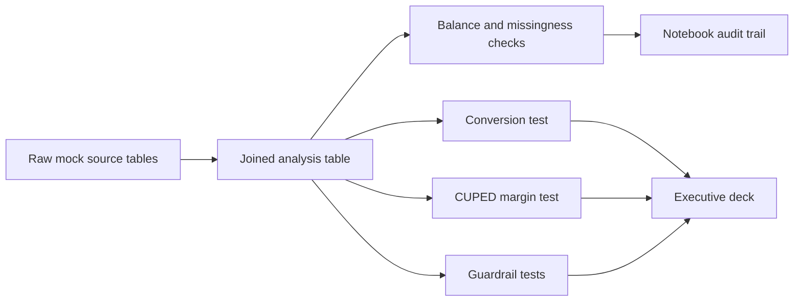

<!-- _class: lead -->

# Roll out the personalized roaming prompt to unlock CHF 4.7M annual margin with no guardrail breach.

- A customer-level randomized A/B test on 60,000 synthetic Sunrise app customers shows a conversion lift of **1.10 pp**.
- CUPED estimates **CHF 0.13** incremental margin per eligible customer per 14 days, with a 95% CI of **CHF 0.06 to CHF 0.21**.
- Recommendation: launch through a monitored 25% ramp, then scale to all eligible app customers if guardrails remain green.

---

# The business request was translated into a randomized revenue-and-experience decision framework.

> **Decision lens:** the prompt ships only if commercial upside and customer experience both improve.

| Design choice | Specification |
|---|---|
| Stakeholder decision | Ship, iterate, or stop a personalized roaming-pack prompt |
| Randomization unit | Customer, assigned 50/50 to control or treatment |
| Target population | Eligible Sunrise mobile-app customers before summer travel |
| Primary metric | 14-day roaming-pack conversion rate |
| Business metric | 14-day gross margin CHF per customer |
| Decision rule | Significant conversion and CHF lift, with all guardrails passing |

---

# CUPED is the right method because pre-period roaming spend explains margin variation without changing randomization.

> **Analytical takeaway:** one headline effect chart is enough here because the precision gain is the key methodological decision.

- Standard conversion test: two-sided difference in proportions at alpha = 5%.
- CHF estimate: Welch mean difference on margin, plus CUPED using pre-period roaming revenue.
- Rigor: customer-level randomization avoids pre/post bias; balance checks reduce sample-selection risk; guardrails prevent revenue-only launch logic.

---

# The treatment creates CHF 4.7M expected annual margin versus the current app experience.

> **Business takeaway:** even the conservative confidence floor supports rollout economics.

| Scenario | Conversion | Margin lift | Annualized margin |
|---|---:|---:|---:|
| Current app experience | 7.61% | CHF 0.00 | CHF 0.0M |
| Personalized prompt | 8.71% | CHF 0.13 / customer / 14d | CHF 4.7M |
| Conservative CI floor | +0.66% | CHF 0.06 / customer / 14d | CHF 2.0M |

---

# A one-week ramp is sufficient to validate production performance before full scale.

> **Operating model:** keep the narrative simple for stakeholders: prove lift, monitor guardrails daily, then scale.

| Launch control | Requirement |
|---|---|
| Power design | 30,655 customers per group to detect a 0.6 pp MDE |
| Traffic assumption | 8,500 eligible customers per day |
| Minimum test duration | 8 days for a fully powered confirmatory read |
| Ramp proposal | 25% for one week, 50% for one week, then 100% if guardrails pass |
| Guardrails | NPS, support contacts, and app opt-outs monitored daily |

---

# Customer-experience guardrails stayed green, so the next decision is operational rollout approval.

> **Risk framing:** the launch case holds because the experience metrics remain inside pre-agreed stop limits.

- NPS difference stayed inside the -1.5 point stop threshold.
- Support contact and app opt-out differences stayed below their rate thresholds.
- Retain a 5% post-launch holdout for four weeks to measure persistence and seasonality.

---

# Appendix: Randomization balance supports a causal read of the treatment effect.

- All audited pre-treatment covariates are inside the absolute SMD < 0.05 balance rule.
- Balance was checked before outcome analysis to avoid tuning the design after seeing results.
- Synthetic source tables mimic CRM, billing, app engagement, assignment, and outcome systems.

---

# Appendix: CUPED variance reduction increases precision without changing the estimand.

| Diagnostic | Result |
|---|---:|
| CUPED theta | 0.245 |
| Standard margin lift | CHF 0.16 |
| CUPED margin lift | CHF 0.13 |
| Variance reduction | 25.2% |
| CUPED p-value | 5.85e-04 |

- Pre-period roaming revenue is measured before randomization, so it improves precision without absorbing treatment impact.

---

# Appendix: The project artifacts provide a reproducible audit trail for review and rerun.

- Notebook: `notebooks/ab-test-mock-data.ipynb`
- Source and processed artifacts: `notebooks/ab-test-mock-data/`
- Stakeholder deck: `docs/ab-test-mock-data/deck.md`
