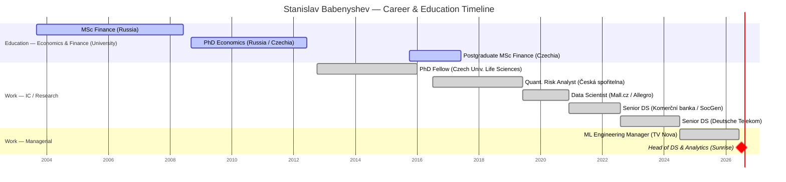

# Stanislav Babenyshev

> This is your own profile — the reference point the people-profile skill uses to find common ground with everyone else. No "Common ground" section here.

## Snapshot
Data Science & Analytics leader with a PhD in Economics and 9+ years bridging advanced DS, ML, causal inference, and business strategy. Currently ML Engineering Manager at TV Nova, leading a 12-FTE cross-functional team (ML, Data Engineering, Business Analysis). Deep hands-on ML across recommender systems, NLP/deep learning, and increasingly agentic AI (MCP, Google ADK). Core identity: **translator between technical specialists and C-level stakeholders** — turning complex math into actionable decisions and measurable ROI. Made the academia→industry move himself in 2016. Cloud-certified across AWS, GCP, and Azure.

## Priorities & what they care about
- Turning rigorous methods into business decisions and measurable ROI (the translator role).
- Capability building, delivery frameworks, hiring, and mentoring technical staff.
- Causal inference & experimentation done rigorously (A/B, switch-back, MAB/bandits, uplift).
- Staying at the frontier — recommender systems, GenAI/RAG, agentic AI.
- AI governance and analytics roadmapping.

## How to work with them
- Comfortable at both ends: hands-on (Python, PyTorch, PySpark, Databricks, SQL) and C-level advisory.
- Strong bias toward experimentation and measurable impact.
- Working languages: English & Czech (C1), Russian native, German at A2 (improving).

## Open threads
- [ ] —

## Timeline
<!-- colour legend: active = universities · done = prior employers · crit = current role (Sunrise). -->

## Career & education history
- **2026-07–present** — Head of Data Science & Analytics, Sunrise (ADAO)
- **07/2024–2026** — ML Engineering Manager, TV Nova, Prague (12-FTE cross-functional team; hiring/KPIs, ML systems design & roadmapping; recommender systems, market share, churn/LTV, agentic AI; Databricks/GCP/Python/MCP/ADK)
- **08/2022–07/2024** — Senior Data Scientist (III→VII), Deutsche Telekom, Bonn (conversational agent "Frag Magenta"; NLU/Rasa Transformers, LDA/BERTopic clustering, MAB/RL, A/B framework; procurement ML: tender optimization (PuLP), BERT classification, RAG GenAI pilot; led juniors)
- **12/2020–08/2022** — Senior Data Scientist, Komerční banka (Société Générale), Prague (loan-size regression, bLSTM comment classification, topic modelling; mentored junior)
- **06/2019–12/2020** — Data Scientist, Mall.cz (Allegro), Prague (dynamic pricing, ad-auction bidding, RecSys; A/B design & analysis, causal inference)
- **05/2017–06/2019** — Quantitative Risk Analyst III (Strategic Risk), Česká spořitelna (Erste Group), Prague (corporate/SME scorecards, early-warning isolation-tree)
- **07/2016–05/2017** — Quantitative Risk Analyst Trainee, Česká spořitelna (PD model IFRS 9, CCF model Basel III)
- **10/2012–01/2016** — PhD Fellow, Czech University of Life Sciences Prague (academic research, scientific writing)
- **Education**
  - **PhD Economics**, Kuban State University (2008–2012) — economic efficiency & investment; Erasmus visiting researcher at Czech Univ. of Life Sciences (2008–2012), applying time-series cointegration to macro indicators (FDI→GDP)
  - **MSc Finance**, University of Finance & Administration, Prague (2015–2017) — thesis on trinomial distribution for options pricing
  - **MSc Finance**, Stavropol State Agricultural University (2003–2008) — Potanin & academic merit scholarships
- **Certifications** — AWS Cloud Solutions Architect (2024), Google Cloud ML Engineer (2024), Azure Data Scientist DP-100 (2023); Coursera specializations: Software Design & Architecture + Reinforcement Learning (Alberta, 2022), Deep Learning (DeepLearning.AI, 2020)
- **Honors** — Best Master's Thesis, Quantitative Finance (2017); Best Scientific Article, PhD Conference (2012)

## Interests & hobbies
- **Volleyball** — beach & indoor, played in amateur league competitions (most competitive of the bunch).
- **Jogging** — 10km under 50 min; recreational now, not racing.
- **Social dance** (beginner) — salsa, bachata, Lindy Hop, West Coast Swing.
- **Skiing** (intermediate) — more hesitant since a clavicle fracture 2 years ago (2024).
- **Tennis** (beginner), **yoga** (beginner).
- **Tech blog writing.**

## Interaction log
- **2026-07-01** — Self-profile filled in from CV, then refined with fuller LinkedIn history (added PhD Fellow role, precise dates, method/tooling detail). Added hobbies/interests.
