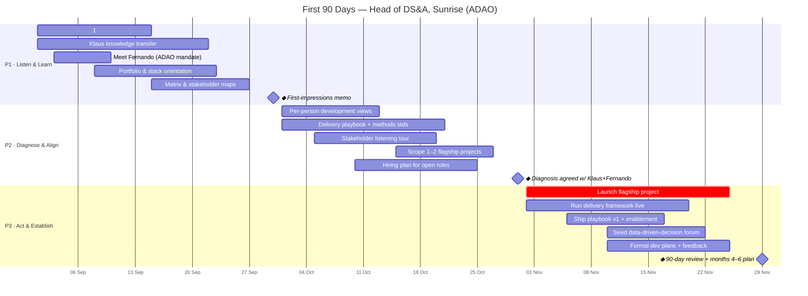

# First 90 Days — Head of Data Science & Analytics, Sunrise (ADAO)

<!-- STATUS: keep this block current on every update -->
| | |
|---|---|
| **Owner** | Stanislav Babenyshev |
| **Manager** | Klaus Lamel (Senior Director Analytics & BI) |
| **BU** | ADAO (led by Fernando) |
| **Start** | 2026-09-01 |
| **Horizon** | 2026-11-29 (Day 90) |
| **Current phase** | Not started — begins 2026-09-01 |
| **Day** | 0 / 90 |
| **Last updated** | 2026-07-01 |

> A deliberately listen-first plan. The role is coach · translator · builder · strategist; the biggest early risk is *acting before understanding a team and a stakeholder web that ran fine without me*. Phase 1 is almost entirely learning; delivery ambition ramps only as context accumulates.
>
> **This page is the overview.** Phase detail (checklists, exit criteria) lives in the per-phase files linked below. The inputs and reasoning behind the plan are in [CONTEXT.md](CONTEXT.md); progress history is in [LOG.md](LOG.md).

## Timeline

<!-- colour legend: default = Phase 1–2 groundwork · crit = flagship delivery · ◆ milestone = phase exit criterion -->

## Phases

| Phase | Window | Theme | Exit criterion (◆) | Detail |
|---|---|---|---|---|
| **1** | Sep 2026 (D1–30) | Listen & Learn | First-impressions memo shared with Klaus | [phase-1-listen-and-learn.md](phase-1-listen-and-learn.md) |
| **2** | Oct 2026 (D31–60) | Diagnose & Align | Diagnosis + priorities agreed with Klaus/Fernando | [phase-2-diagnose-and-align.md](phase-2-diagnose-and-align.md) |
| **3** | Nov 2026 (D61–90) | Act & Establish | Flagship delivered; standards in use; 90-day review | [phase-3-act-and-establish.md](phase-3-act-and-establish.md) |

## Workstreams mapped to the JD mandate

| JD mandate | Where it lives |
|---|---|
| Lead & develop the team | P1 1:1s → P2 dev views → P3 formal dev plans + feedback |
| Define "what good looks like" (playbooks, standards) | P2 draft → P3 ship v1 + enablement |
| High-quality delivery in a matrix | P1 matrix map → P2 delivery framework → P3 run it live |
| Partner with stakeholders; translate Q→analysis→decision | P1 stakeholder map → P2 listening tour → P3 flagship recommendation |
| Back high-value decisions (experimentation, causal inference, impact) | P2 scope → P3 flagship project |
| Build a data-driven-decision community | P3 knowledge-exchange forum |

## How I'll know it's working (90-day success signals)

- [ ] All reports met, profiled, and each has a development direction they co-own
- [ ] Klaus and Fernando agree my diagnosis and priorities are right
- [ ] A written delivery playbook + methods standards exist and have been used on real work
- [ ] One flagship, team-driven decision-support project delivered to a senior stakeholder
- [ ] A recurring community/knowledge-exchange forum is live
- [ ] Open ADAO roles moving with a clear target team shape
</content>
