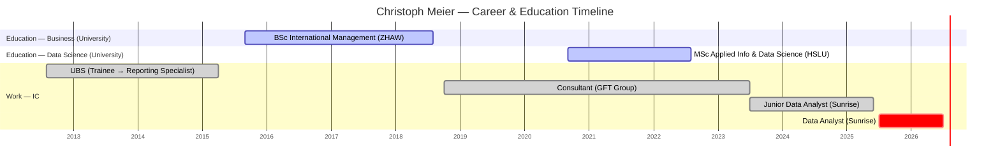

# Christoph Meier

## Snapshot
Data Analyst at Sunrise (since Jul 2023, promoted from Junior in Jul 2025). BI/analytics-oriented — SQL, Python, Teradata, QlikSense — with a strong consulting and business background (GFT digital-transformation consultant, UBS finance). Applied route into data: commercial apprenticeship → UBS trainee → consultant → BSc International Management → MSc Applied Information & Data Science. Reads as a **"Business Consultant / translator" profile** (per the team's Scientist-vs-Consultant split) — complements the deep-methods scientists like [Nora](nora-ballinari-bearth/nora-ballinari-bearth.md).

## Priorities & what they care about
- Practical, stakeholder-facing analytics: reporting, ad-hoc analysis, data literacy (was explicitly an "internal consultant to improve data-driven decision making").
- Digital transformation & process improvement (SAFe/SCRUM background from GFT).
- Likely values clear delivery, business relevance, and communication over methodological depth (inferred from his path).

## How to work with them
- Business-fluent and consulting-trained — good bridge to stakeholders; agile/SAFe delivery vocabulary.
- Native German, full-professional English — comfortable working language either way.
- <Confirm his growth ambitions: deepen technical/ML methods, or lean further into consulting/BI leadership? — TBD.>

## Common ground with you
- **Internal consultant / translator mindset** — he was an "internal consultant for data-driven decision making"; your core identity is translating math→business for stakeholders. Shared worldview.
- **Finance/banking roots** — he came up through UBS (finance trainee, reporting); you spent years in banking risk (Česká spořitelna, Komerční banka). Common early-career ground.
- **Digital transformation / automation** — his GFT process-automation work echoes your procurement-digitization projects at Deutsche Telekom.
- **Tools** — SQL and Python are shared daily tools.
- Language: German is his native tongue and your A2 target — an easy bridge. Both now based in the Zurich area (he: Winterthur; you: Cham).

## Open threads
- [ ] Clarify his development goals — technical/ML depth vs. consulting/BI leadership track.
- [ ] Understand his current portfolio (reporting vs. ad-hoc vs. project work) and top stakeholders.

## Timeline
<!-- colour legend: active = universities (ZHAW, HSLU) · done = prior employers (UBS, GFT) · crit = current role (Sunrise). Pre-university commercial apprenticeship (2009–2012) omitted. -->

## Career & education history
- **Jul 2025–present** — Data Analyst, Sunrise, Zurich
- **Jul 2023–Jun 2025** — Junior Data Analyst, Sunrise (non-financial business reporting; ad-hoc analysis for strategy & transformation; internal data-literacy consultant; SQL/Python/Teradata/QlikSense)
- **Oct 2018–Jul 2023** — Consultant, GFT Group, Zurich (digital transformation & process automation; SCRUM/SAFe, requirements engineering, BPML, Axon Ivy, Flowable)
- **Aug 2012–Apr 2015** — UBS, Zurich: JUNA Finance Trainee Program (2012–2014) → Financial Reporting Specialist (Jan–Apr 2015, before full-time studies)
- **2009–2012** — Kaufmännische Ausbildung (commercial apprenticeship), pre-university
- **Education**
  - **MSc Applied Information & Data Science**, Lucerne Univ. of Applied Sciences & Arts (HSLU, 2020–2022)
  - **BSc International Management**, ZHAW School of Management and Law (2015–2018)
- **Certifications** — SAFe 5 Product Owner/Manager (2022) & Practitioner (2020), IBM Watson Chatbot Challenge (2022), Avaloq Certified Professional (2018), IELTS General 8.0 (2017), Presentation Excellence (2019)

## Interaction log
- **2026-07-01** — Profile created and enriched from LinkedIn ahead of onboarding.
