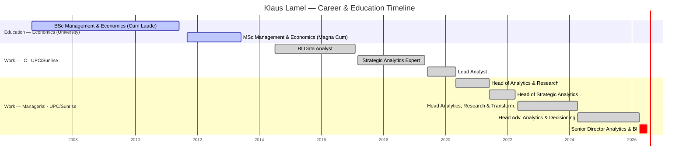

# Klaus Lamel

## Snapshot
The user's manager at Sunrise — **and his direct predecessor**. Klaus previously held the very role Stanislav is stepping into (Head of Data Science & Analytics, per his LinkedIn "Head of Advanced Analytics & Decisioning", Apr 2024–Apr 2026); his promotion to **Senior Director Analytics & BI** (Apr 2026) opened the vacancy. So the DS&A team Stanislav is inheriting reported to Klaus until now. Long-tenured analytics leader (at Sunrise/UPC since 2014), with a deep advanced-analytics background — causal inference, simulation, forecasting, ML-driven interventions. Economics/management academic background (both degrees from University of Zurich, with honours).

## Priorities & what they care about
- **Advanced analytics as decision support** — his consistent framing across roles: analytics + internal consulting to drive decisions and identify opportunity (inferred from his role history).
- **Test-learn-scale** — explicitly advocated experimental design/evaluation and A/B-style interventions; ML targeting churn and NPS.
- **Counterfactuals & simulation** — used models/ML to build counterfactuals and anticipate outcomes. Overlaps strongly with the user's causal-inference strength.
- Likely values best-practice/community-building (was "champion for best practices in the data community" and did mentoring/training as Lead Analyst).

## How to work with them
- Speaks the same methodological language as the user (causal inference, experimentation, forecasting) — technical rigor will land with him.
- Has managed 5–8 direct reports across several roles; experienced people-leader, so expect leadership/coaching to be a shared vocabulary.
- **He built and ran this exact role and team** — he knows every report personally, the projects, the stakeholders, and "how things were done." Huge asset for onboarding; treat him as your best source of context. Balance: he'll have strong priors on how the role should run, so surface where you'd do things differently early and deliberately rather than diverging silently.
- <Confirm his current priorities and expectations for the DS team once you meet — TBD.>

## Common ground with you
- **Causal inference & decisioning** — his last role was "Head of Advanced Analytics & Decisioning"; your core is causal inference/uplift/experimentation. Same worldview.
- **Test-learn-scale** — he explicitly advocates it; you've built A/B + switch-back experimentation tooling. Shared conviction.
- **Economics background** — his degrees are in Economics (UZH); you hold a PhD in Economics. Common academic language.
- **Telecom domain** — you spent 2 years at Deutsche Telekom; he's spent his career at UPC/Sunrise. Shared industry context.
- **Team leadership** — both run/ran DS teams of similar size (he: 6–8; you: 12 FTEs).
- Language: English is the shared working language; German is his (native, inferred) — your A2 is a bridge to build.

## Open threads
- [ ] Clarify his current mandate as Senior Director Analytics & BI and how ADAO / the DS team fits under him.
- [ ] Understand how he defines "good" for the team (standards, playbooks) — the JD emphasizes this, and he set the current bar.
- [ ] As predecessor: get his read on each report (strengths, growth areas, ambitions) and the in-flight projects before you form your own.
- [ ] Understand *why* the role was split off / what changed with his promotion — what does he now want from the DS&A head that he couldn't do himself?
- [ ] Learn his stance on reactive-vs-proactive balance for the team.
- [ ] Watch for the "how I used to run it" dynamic — agree explicitly on your autonomy vs. where he stays involved.

## Timeline
<!-- colour legend: active = University of Zurich · done = UPC/Sunrise (same employer through rebrand) · crit = current role -->

## Career & education history (UPC/Sunrise since 2014)
- **Apr 2026–present** — Senior Director Analytics & BI
- **Apr 2024–Apr 2026** — Head of Advanced Analytics & Decisioning (managed 6 Senior Data Scientists; simulations, counterfactuals via ML)
- **May 2022–Apr 2024** — Head of Analytics, Research & Transformation (2 teams, 8 direct reports; churn/NPS ML interventions; test-learn-scale)
- **Jun 2021–Apr 2022** — Head of Strategic Analytics (5 reports; causal inference, forecasting; post-merger team integration)
- **May 2020–Jun 2021** — Head of Analytics & Research (5 reports)
- **Jun 2019–May 2020** — Lead Analyst (best-practice champion; mentoring/training)
- **Mar 2017–May 2019** — Strategic Analytics Expert (senior analyst; work for C & VP layer)
- **Jul 2014–Feb 2017** — BI Data Analyst
- **Education** — MSc Management & Economics, Univ. Zurich (Magna Cum Laude, 2013); BSc same (Cum Laude, 2011).

## Interaction log
- **2026-07-01** — Profile created and enriched from LinkedIn history ahead of onboarding.
- **2026-07-01** — Noted key context: Klaus is Stanislav's **predecessor** in the Head of DS&A role; his promotion to Senior Director created the vacancy, and the team reported to him until now.
