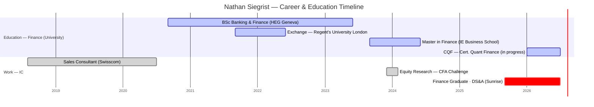

# Nathan Siegrist

## Snapshot
Early-career **Finance Graduate** rotating in the Data Science & Analytics team (joined Sunrise Sep 2025). Strongly finance-quant: Master in Finance from IE Business School (IB/PE track, FT top-10 programme), BSc Banking & Finance (HEG Geneva), and currently completing the **CQF (Certificate in Quantitative Finance)** — whose ML modules show him actively bridging finance → data science. Works in Python/SQL on customer behaviour, revenue dynamics, KPIs, churn, and LLM-based text analysis. Explicitly drawn to the **finance × data × strategy** intersection. First French-native on the team (from Geneva).

## Priorities & what they care about
- The intersection of finance, data, and strategy — analytical thinking that drives measurable business impact (his own stated aim).
- Building quant + ML depth (CQF in progress) on top of a strong finance/valuation foundation.
- As an early-career graduate, likely hungry for growth, mentorship, and a clear development path (inferred).

## How to work with them
- Finance-fluent and quant-minded; strong modelling/valuation grounding (equity research, DCF, CFA Research Challenge).
- Native French, full-professional English; German only limited — **English is the safest working language** with him, and note the language difference from the German-native reports.
- <Confirm whether he wants to grow toward DS/ML depth or finance-strategy analytics — TBD.>

## Common ground with you
- **Finance & quant finance — the standout match.** You hold two MSc Finance degrees + a quant-finance thesis (trinomial options pricing); he's doing the CQF (stochastic calculus, quant finance) after an MSc Finance. Deep shared vocabulary.
- **You *are* the path he wants.** He aims for finance × data × strategy; you went finance/economics → risk → data science yourself. Best career-trajectory mentoring match on the team so far.
- **Telecom** — he was a Swisscom sales consultant; you were at Deutsche Telekom. Both telecom, now both at Sunrise.
- **Finance → ML crossover** — his CQF ML modules are exactly your home turf; natural place to coach him.
- Language: English is the shared strong language (his German is limited, unlike Nora/Christoph/Klaus).

## Open threads
- [ ] Clarify his target track post-graduate-programme: DS/ML depth vs. finance-strategy analytics.
- [ ] He's mid-CQF (Jan–Jul 2026) — worth supporting; aligns his quant-finance study with real Sunrise problems.
- [ ] Early-career: define a concrete development plan and mentorship.

## Timeline
<!-- colour legend: active = universities/institutes · done = prior employers (Swisscom, CFA Challenge) · crit = current role (Sunrise). CQF is in progress (2026). -->

## Career & education history
- **Sep 2025–present** — Finance Graduate, Data Science & Analytics, Sunrise, Zurich (finance/marketing/strategy/ops decision support; Python/SQL; churn, text classification, LLMs; legacy→Google Cloud migration)
- **Dec 2023–Feb 2024** — Equity Research Analyst, CFA Research Challenge, Madrid (sell-side report, DCF & multiples valuation, 5-yr forecast)
- **Aug 2018–Jul 2020** — Sales Consultant, Swisscom, Geneva
- **Education**
  - **CQF — Certificate in Quantitative Finance**, CQF Institute (Jan–Jul 2026, in progress) — incl. ML I/II (supervised & unsupervised)
  - **Master in Finance**, IE Business School (2023–2024, GPA 3.51; IB/PE track; FT top-10 programme)
  - **BSc Business Administration — Banking & Finance** (minor Risk Management), HEG Geneva (2020–2023, GPA 3.65; ISFB prize for top finance grades); exchange semester at Regent's University London (2021–2022, First Class)
- **Awards / scores** — ISFB prize (2023); GMAT 680, TOEFL 112 (2023); HSK 2 Chinese 194/200 (2022)

## Interaction log
- **2026-07-01** — Profile created and enriched from LinkedIn ahead of onboarding.
