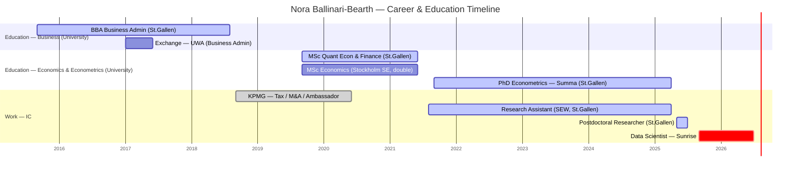

# Nora Ballinari-Bearth

## Snapshot
Data Scientist on the team, joined Sunrise Sep 2025 — her first industry role straight out of academia. PhD in Econometrics from University of St.Gallen (Summa cum laude, 2025), where she developed **causal machine learning** methods. Publishes as **Nora Bearth** (SEW-HSG); specialises in double/debiased ML, treatment-effect heterogeneity (GATE/BGATE), and **optimal policy learning** — with a paper in the *Journal of Applied Econometrics* (2026). Directly overlaps with the team's (and your) causal-inference mandate — likely the deepest methods specialist among the reports. Climber/skier/hiker; from the Romansh-speaking part of Graubünden.

## Research / publications
Full breakdown in [publications-analysis.md](publications-analysis.md); PDFs in [publications/](publications/). She is **first author** on 3 papers (child-penalty DiD study; *Causal ML for Moderation Effects* / BGATE; *Fairness-Aware & Interpretable Policy Learning*) and co-author on 2 more (incl. the JAE 2026 propensity-score-calibration paper).

**The key takeaway:** her research *is* the academic backbone of what the team does operationally — **policy learning / heterogeneous treatment effects = uplift & targeting** (who to give which offer/retention action), and she works in **causal inference without RCTs** (DiD, DML, propensity scores on observational data) — exactly the round-1 project type *"experiment with no RCT."* Her fairness/interpretability work also maps to **AI governance**.

## Priorities & what they care about
- Rigorous, research-grade causal ML / econometrics — this is her identity and her edge (inferred from PhD + stated interests).
- As a recent academic-to-industry mover, probably still calibrating how much rigor vs. speed the business wants — a coaching opportunity.

## How to work with them
- Speaks the deepest methods language on the team; she'll respond to rigor and can raise the bar for others (potential methods mentor / best-practice champion).
- Fresh from academia → the highest-leverage coaching is likely **translation**: connecting rigorous methods to business decisions and pace (exactly the "translator" part of your role).
- Native German and Romansh, professional English. German is her working language — relevant given the JD's "German advantageous".

## Common ground with you
- **Causal ML / causal inference** — her PhD is in causal machine learning; your core is causal inference + uplift modeling (uplift ≈ applied causal ML). The strongest, most specific connection.
- **Policy learning = your uplift/targeting work** — her optimal-policy-learning research (who to assign which treatment) is the theory behind uplift modeling for CRM/retention; you've built the applied version. Immediate shared project language.
- **Doctorate in economics/econometrics** — she: PhD Econometrics (St.Gallen, Summa); you: PhD Economics. Shared academic depth and language.
- **Experimentation mindset** — her empirical-economics training pairs directly with your A/B / switch-back experimentation work.
- **Academia → industry — you've lived it.** You made the same leap in 2016 (PhD Fellow → first industry role) after your own doctorate. You can mentor her transition from direct experience, not just observation.
- **Empirical econometrics** — her SEW/St.Gallen empirical-economics training echoes your PhD econometrics work (time-series cointegration, macro modelling); both of you work in R.
- Language: German is her native tongue and your A2 target — a natural, low-stakes way to build rapport. English is the shared working language.
- **Skiing** — you both ski (she also climbs/hikes; you're intermediate but more cautious since a 2024 clavicle break — a genuine, relatable opener).

## Open threads
- [ ] Understand what she wants from her first industry role / career goals — early-career, first non-academic job.
- [ ] Gauge her appetite to be the team's causal-ML methods anchor / mentor.
- [ ] Confirm home region + language details in conversation (currently partly inferred).

## Timeline
<!-- colour legend: active = University of St.Gallen (primary institution) · default = other universities (Stockholm SE, UWA) · done = KPMG · crit = current role (Sunrise) -->

## Career & education history
- **Sep 2025–present** — Data Scientist, Sunrise (first industry role)
- **May 2025–Jul 2025** — Postdoctoral Researcher, University of St.Gallen
- **Aug 2021–Apr 2025** — Research Assistant, SEW (Swiss Institute for Empirical Economic Research), University of St.Gallen
- **Sep 2018–Jun 2020** — KPMG Switzerland: Corporate Tax Intern → M&A Intern → Student Ambassador (Zurich)
- **Education**
  - **PhD Econometrics**, University of St.Gallen (Summa cum laude, 2021–2025) — causal machine learning
  - **MSc Quantitative Economics & Finance**, St.Gallen + **MSc Economics**, Stockholm School of Economics (double degree, 2019–2021)
  - **Exchange semester**, University of Western Australia (2017)
  - **BBA Business Administration**, University of St.Gallen (2015–2018)
  - Psychology, University of Zurich (2014–2015, prior to BBA)
- **Certifications** — TOEFL iBT 105 (2018); Cambridge CAE (2014)
- *(Pre-university roots: hospitality/admin roles in Chur, Sedrun & Disentis, Graubünden — basis for the home-region inference.)*

## Interaction log
- **2026-07-01** — Profile created and enriched from LinkedIn ahead of onboarding.
- **2026-07-01** — Reorganised into a folder; added her publications and a first-author analysis ([publications-analysis.md](publications-analysis.md)).
