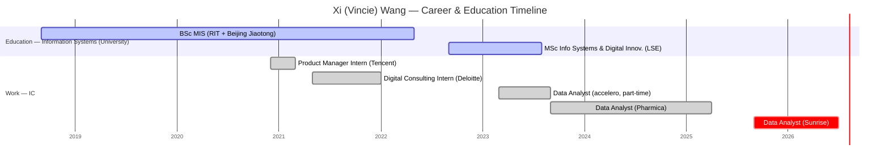

# Xi (Vincie) Wang

> Goes by **Vincie**.

## Snapshot
Data Analyst / Analytics Engineer on the Performance Analytics team (Data Centre of Excellence), joined Sunrise Sep 2025. **Retention / churn specialist** with heavy **A/B testing** and user-journey analysis; strong on communication and business context ("the dot connector"). Notably technical for an analyst — Python + BI stack plus ML exposure (transformer time-series forecasting, NLP, a simulated-RCT clinical-data project). Highly international path: China → US (RIT) → UK (LSE + London analyst roles) → Switzerland. Cross-industry: telecom, pharma, e-commerce.

## Priorities & what they care about
- Retention & churn (base-management), experimentation, and clean/reliable data driving customer-experience impact — her stated specialisation.
- Communication and business context — framing analysis so it actually solves the problem.
- Fast learning / agile delivery (self-described "fast-learning mindset").

## How to work with them
- Strong communicator and business translator; agile (Jira/Octane) delivery style.
- English working language (her German is not listed — likely limited; confirm). Mandarin native.
- Curious and technical — will likely welcome stretch into ML/DS work (has transformer/NLP project experience).

## Common ground with you
- **Experimentation & A/B testing** — she's run 40+ A/B/pre-post tests and even simulated an RCT on clinical data; experimentation is your core (A/B, switch-back, MAB). Strong, specific match.
- **Churn / retention modelling** — she specialises in it; you've built churn/LTV models (TV Nova, Deutsche Telekom). Same problem space.
- **Telecom + e-commerce** — her Sunrise/Tencent + your Deutsche Telekom + your Mall.cz e-commerce years overlap on industry.
- **Transformers / NLP / RecSys** — her LSE transformer time-series work and Tencent RecSys/NLP map onto your deep-learning/NLP background — natural coaching ground.
- **International transplant in Switzerland** — you both built careers across countries and arrived in CH non-native to the local languages; genuine shared experience (and a reason English bonds you, as with Nathan).

## Open threads
- [ ] Confirm languages (esp. German level) — inferred for now.
- [ ] Clarify the matrix: she sits in Performance Analytics (Data CoE) — how does that map to your reporting line?
- [ ] Growth goals: analytics-engineering depth vs. stretch into DS/ML (she has the aptitude and project history for it).

## Timeline
<!-- colour legend: active = universities (RIT/Beijing Jiaotong, LSE) · done = prior employers (Tencent, Deloitte, accelero, Pharmica) · crit = current role (Sunrise). -->

## Career & education history
- **Sep 2025–present** — Data Analyst / Analytics Engineer, Sunrise, Zurich (Performance Analytics / Data CoE; retention & churn; BigQuery/GCP, Teradata, Python, Qlik Sense, Figma, Jira)
- **Sep 2023–Apr 2025** — Data Analyst, Pharmica, London (retention products +4.8%, £80K saved; 40+ A/B & pre/post tests → +29% organic revenue, −19.7% abandonment; CLTV automation; GDPR server-side pipelines)
- **Mar 2023–Sep 2023** — Data Analyst (part-time), accelero group, London (time-series prep, data cleaning, Tableau)
- **May 2021–Jan 2022** — Digital Consulting Intern, Deloitte, Shenzhen (CRM optimization, marketing automation, SIT/UAT)
- **Dec 2020–Mar 2021** — Product Manager Intern, Tencent, Shenzhen (QQ browser recommendation queries, A/B testing, NLP; grew lexicon 300K→10M)
- **Education**
  - **MSc Management of Information Systems & Digital Innovation**, LSE (2022–2023) — deep learning, managing AI, quantitative marketing analytics
  - **BSc Information Management Systems**, Rochester Institute of Technology (2018–2022, GPA 3.76, Dean's List) + **BSc Management Information Systems**, Beijing Jiaotong University (2018–2022) — dual/joint programme
- **Certifications** — Google BigQuery for Data Analysts (2025), Derive Insights from BigQuery (2025), Google Analytics IQ (2023)
- **Selected projects** — Transformer vs. ARIMA time-series forecasting (LSE); simulated RCT on 577K-record clinical big data (Apriori/clustering/t-test); VISA sustainability solution (top-5 finalist)

## Interaction log
- **2026-07-01** — Profile created and enriched from LinkedIn ahead of onboarding.
